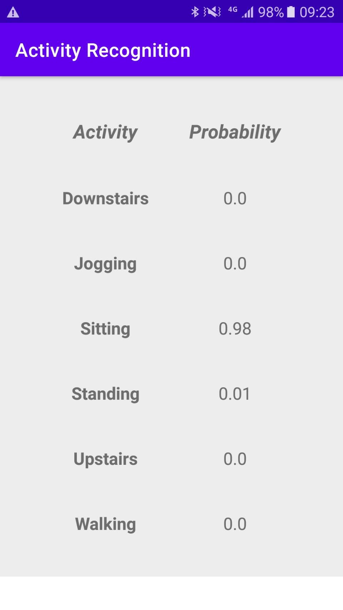

# Human Activity Recognition with LSTMs

## Reference
inspired by:
- [TensorFlow-on-Android-for-Human-Activity-Recognition-with-LSTMs](https://github.com/curiousily/TensorFlow-on-Android-for-Human-Activity-Recognition-with-LSTMs)